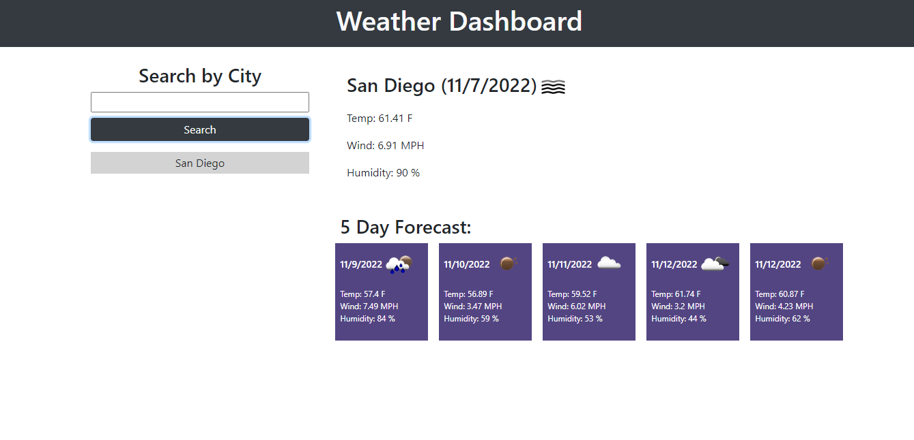

# Weather Dashboard

## Description

The motivation for this project was to create a Weather Dashboard that a user can use to search the current weather by city, along with a 5 day forecast. This project was built to familiarize myself with using Server-Side APIs and making fetch requests. This project solves the problem of using a Server-Side API to retrieve third party data by using the fetch function. After using fetch, this project also parses through that data and present the user with the filtered response. Overall, I learned how to make API requests and parsing through the response data to use in my own projects.

## Installation

N/A

## Usage

On first load, the user is presented with a input text area and a search button to initiate their search. By submitting their search, the user will then be presented with the current weather, along with the 5 day forecast. The application will store the user's previous search terms by city, and if the user has not searched that city before, a quick search button will be generated, linking the user to the weather for the city listed under the corresponding button.

This project uses Open Weather Map's Current Weather API to generate data for the current weather and their 5 Day Forecast API to generate the data for the 5 Day Forecast section. The underlying code retrieves the data as of the time the request is made. The 5 Day Forecast API also provides the user with 40 data entries with index 0 starting at the closes 3 hour mark to the current time, and with subsequent data entries spaced out by 3 hours. From the 40 data entries, I decided to use the entries at indices 8, 16, 24, 32, and 39. Starting at index 8 ensures the first data slot is at least 24 hours from when the request is made. Selecting every 8th index also ensures the subsequent data entries are 24 hours from the previous. Due to the limitations of the API, the user is only able to pull 40 entries, so the alst index must be index 39. For this reason, in the example above, the last entry is on teh same date as the previous (11/12/22).

## Credits

This project uses Bootstrap. Documentation can be found at https://getbootstrap.com/docs/4.5/getting-started/introduction/

## License

N/A